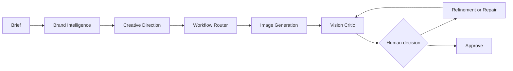
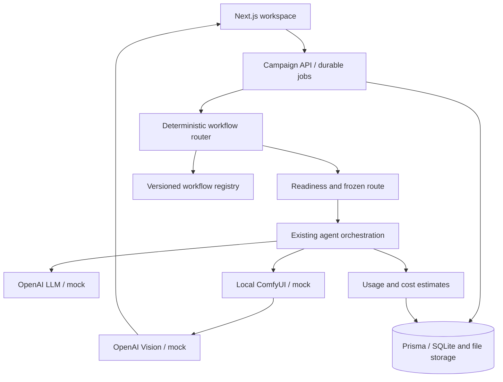
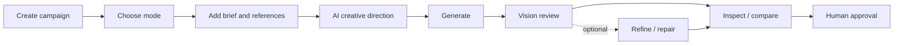

# CreativeFlow AI

**An agentic creative-production workspace that turns a brand brief into campaign assets using workflow routing, generative image pipelines, Vision QA and human approval.**

Local-first · TypeScript / Next.js · OpenAI Responses · ComfyUI · SQLite

**v1.0 release candidate.** Mock mode is free to explore. Real workflows remain experimental unless their registry explicitly says otherwise. This repository has not been published as part of the release-preparation task.



## Quick start — no keys, models or Docker

Install Node.js 22 LTS and npm (minimum Node 20.19). On Windows, use PowerShell in a writable project folder. A GPU and Python are **not** required for mock mode.

```bash
git clone <your-repository-url> creativeflow-ai
cd creativeflow-ai
npm ci
npm run setup
npm run dev
```

Open [CreativeFlow on localhost](http://127.0.0.1:3000). `npm run dev` starts both the web app and its local job worker; Ctrl+C stops them. `dev:all` remains an alias. The repository URL is a placeholder until the owner publishes it.

Setup creates `.env` only if missing, initializes SQLite and seeds **Quiet Energy** with five mock SVG compositions, V1/V2 history and simulated reviews. It does not overwrite existing settings or completed demo records. All three providers default to `mock`; seed providers are explicitly mock even if you already configured real credentials.

### Explore safely

1. Open Quiet Energy. Inspect Direction, Prompt and Review. Mock scores are simulated, not pixel analysis.
2. Compare V1 and V2, expand version metadata and usage, and open Brand Intelligence.
3. Create a **Social Fast** campaign in mock mode. No API key or ComfyUI is needed.
4. Inspect the review, then approve the latest version if you accept it. Approval is a human decision, not a score threshold.

Mock assets are SVG layouts, not generated photography. Mock reviews and usage are explicitly labeled; Brand Intelligence opens with an empty, reviewable rules workspace. Commercial Poster and Product Hero require real providers; readiness explains missing requirements.

## What it demonstrates

- **Creative production:** structured Brand, Creative Director, Prompt Engineer and Refinement agents; mode-specific intent and deterministic routing.
- **Local image workflows:** ComfyUI automation, experimental Klein Commercial Poster, product preservation and existing sports/legacy workflows.
- **Quality decisions:** real multimodal Vision QA, Brand Guideline Intelligence, bounded refinement, targeted repair, version comparison and human approval.
- **Operational visibility:** readiness, durable jobs/cancellation, immutable generation versions, workflow registry/hashes, development benchmarks and usage estimates.

## Creative Modes

| Mode | Route | Current status |
| --- | --- | --- |
| Commercial Poster | Klein `commercial_poster_v1` | Experimental, Hero 880 × 592 only |
| Product Hero | `product_hero_v1` | Experimental product extraction/compositing |
| Sports Advertising | `sports_pose` with pose; `sports` otherwise | Existing legacy workflows |
| Lifestyle Campaign | `quality` | Legacy fallback, no dedicated validated Lifestyle workflow |
| Social Fast | `basic` | Legacy; mock-friendly entry point |
| Custom / Advanced | Compatible registered selection | Selected workflow's maturity |

Jobs freeze their route before execution. Missing dependencies block execution; there is no silent fallback. Poster's three-seed development benchmark completed 3/3 without OOM, with consistent commercial composition but limited exact SKU fidelity. It is not production certification. [Routing details](docs/creative-modes.md).

## Screenshots and demo

The curated gallery mixes a clearly identified live poster with the free mock walkthrough. It does not imply that simulated mock reviews are real Vision results.


See the [demo script](docs/demo-script.md), [golden demo result](docs/golden-demo.md) and [screenshot gallery](docs/screenshots/README.md).

## Enable real providers — optional

Keep secrets only in your local `.env`, then restart the app:

```dotenv
LLM_PROVIDER=openai
OPENAI_API_KEY=<your-server-side-key>
OPENAI_MODEL=gpt-4.1-mini
IMAGE_PROVIDER=comfyui
COMFYUI_URL=http://127.0.0.1:8188
COMFYUI_CHECKPOINT_NAME=<installed-legacy-checkpoint-filename>
VISION_PROVIDER=openai
VISION_MODEL=gpt-4.1
COMFYUI_KLEIN_URL=http://127.0.0.1:8190
```

Enable text alone by retaining mock image and Vision providers. Real Vision requires real PNG outputs, not mock SVGs. The existing ComfyUI adapter also validates the legacy endpoint/checkpoint configuration; selecting Poster does not require installing unrelated pose/detailer models.

**Commercial Poster setup is separate from basic installation:** use the official compatible ComfyUI core, Klein 4B Distilled diffusion weights, Qwen text encoder and FLUX VAE. Nothing is auto-downloaded by CreativeFlow. Consult [the pinned local validation](docs/klein-workflow-validation.md) and [poster contract/dependencies](docs/commercial-poster-v1.md), including upstream model licenses. We do not distribute model binaries.

Before execution, readiness reports **OpenAI LLM — Configured**, **ComfyUI / chosen workflow — Ready**, and any required reference/model blockers. Configured does not prove authentication or quota. Poster generation stops before Vision; **Review poster with Vision** explicitly sends the poster, original product reference and campaign context for one paid review. It does not regenerate or refine. [Readiness](docs/provider-readiness.md) · [Provider reference](docs/provider-reference.md).

## Architecture





SQLite stores campaign state, jobs, versions and evaluations; local storage holds references and outputs. OpenAI requests use server-side credentials, structured outputs and schema validation. The app is designed for one local operator, not a public unauthenticated server.

## Validation and contributing

```bash
npm run lint
npm run typecheck
npm test
npm run build
```

Run setup first. Stop the dev server/worker before testing or building: tests use disposable database fixtures and the build shares `.next` with development. Tests use mocked services, not live ComfyUI or paid OpenAI. For a production-mode local session, run `npm start` and `npm run worker` in separate terminals.

[Release checklist](docs/github-release-checklist.md) · [Technical story](docs/technical-story.md) · [90-second walkthrough](docs/demo-script.md).

## Known limitations

- Experimental workflows are not production-certified. Commercial Poster may change sole geometry, markings and other exact SKU details.
- Local image setup depends on compatible models, nodes and GPU memory. Development timings are hardware-specific.
- Vision can miss defects or disagree with human judgment. Usage is estimated cost, not a billing statement.
- Product Hero extraction, integration and repair still need human inspection. Dedicated professional Lifestyle and Sports v2 workflows remain roadmap items.
- Public multi-user/cloud deployment, authentication and collaboration are not the primary v1 target. Bind to localhost; do not expose this server publicly.
- Demo images containing third-party product designs are concept demonstrations, not official advertisements. Verify reference/media rights before publishing externally.

## Roadmap

**v1.x:** Commercial Poster and Product Hero improvements, professional Lifestyle, Sports v2, more reliable local repair.

**v2:** additional cloud/provider options, multi-user collaboration and production deployment. No dates promised.

## License

Application source: [MIT](LICENSE). Model weights, external workflows, nodes and third-party reference images retain their respective licenses; the application license does not relicense them.
