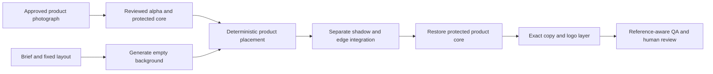

# CreativeFlow commercial workflow architecture

Research date: **2026-09-19, Australia/Sydney**. Status: **design proposal, not a production migration or commercial-quality certification**.

## Decision summary

Build a small family of use-case pipelines around **explicit preservation contracts**, rather than adding more conditioning to one universal graph. For a real SKU, first preserve approved product pixels; generate its environment. For people/action, control composition and pose, then review anatomy and product contact separately. Use local repair only for localized defects. Keep exact copy/logos outside the diffusion stage.

Retain existing provider/storage/job/Vision/usage boundaries. First establish a versioned baseline and benchmark fixtures, then build Product Hero plus single-view Catalogue, then Poster, then Lifestyle and Sports v2. Consider one SDXL candidate after the composition baseline; do not switch all categories to FLUX. Cloud images are worth a future optional adapter, never a silent substitute.

Companion source-of-truth documents:

- [Workflow audit and category matrix](workflow-matrix.md)
- [Benchmark protocol and fixed briefs](workflow-benchmark-plan.md)
- [Registry, routing, quality tiers and migration roadmap](workflow-roadmap.md)
- [Read-only local audit snapshot](workflow-audit-snapshot.json)

### Evidence labels

- **Observed:** repository code, saved images/reviews, local dependency advertisements, current hardware.
- **External pattern:** a technique documented by its authors/maintainers; not evidence that CreativeFlow executes it well.
- **Hypothesis:** an explanation not isolated by a controlled experiment.
- **Recommendation:** a proposed engineering decision to validate later.

No new images, paid reviews, installations or production behavior changes were made for this research. Existing real reviews were read, not rerun. Local repair remains unverified live because the user explicitly deferred that test.

## 1. Current evidence and audit boundaries

Inspected all seven repository workflow JSON files; `lib/providers/image/{comfyui,quality,sports,pose,references,reference-workflow,repair}.ts`; ImageRequest/Result; repair orchestration/masks; generation context; Vision adapter/scoring; stored pose/product comparison artifacts; saved Midnight Pulse generations; README chronology; and local ComfyUI `/object_info` through GET only. `scripts/audit-commercial-workflows.ts` reads these files/database and optionally the local node catalog; it does not import a provider or submit jobs. Snapshot includes template SHA256s, source-image fingerprints, review evidence and a history digest.

Audit found **6 campaigns, 57 generation records, zero active jobs**. GPU reported **RTX 4070 SUPER, 12,282 MiB total VRAM**, 4,623 MiB in use at one observation, driver 560.94. That usage is not a generation peak or guaranteed free budget. Current selected checkpoint is `majicMIX realistic 麦橘写实_v7.safetensors`, mode `auto`; LLM and Vision are OpenAI. Filename/model advertisements do not establish provenance, file hashes, license clearance or compatibility.

### What the saved results establish

| Evidence | Result | What it does not establish |
|---|---|---|
| Basic V1 vs final quality V3, Midnight Pulse | Earlier direct inspection recorded two people vs one and clearer shoes; crossed stride/ankle concerns remained | Mock/legacy scores are not quality evidence; resolution and graph differ |
| Quality V5 vs sports V6 | One athlete each; sports had larger subject/clearer face and front shoe, but rear blur and unwanted bib/text | Mock scores; sampler and prompt also changed, so FaceDetailer benefit is not isolated |
| Sports V7 vs sports_pose V8 | Same saved prompt and reported seed 20260917. Real gpt-4.1: **69 → 69**; product visibility **77 → 80**, prompt adherence **81 → 75** | One paired seed; no general anatomy, face or commercial-quality improvement |
| Product reference, hero V9 / post V1 / product V2 | Real overall **26 / 46 / 44**. Original shoe patterns/colors transferred, geometry and scene drifted | No matched unconditioned control; scores are campaign quality, not reference identity metrics |
| Earlier product V1 | Score 24; wrongly routed to human/pose workflow; corrected product-only routing now selects basic | The correction fixes routing, not SKU fidelity |
| Quality V4 | A saved real review scored 93 | One selected image is not a pass-rate estimate or a fair comparison with later different prompts/settings |
| Repair | Offline tests verify masked preservation, history, queue, review retry | No live repaired image or before/after quality outcome exists |

See [saved pose analysis](../storage/midnight-pulse-pose-comparison.md), [pose reviews](../storage/pose-live-comparison.json), [product trial](../storage/product-live-verification.json), current database snapshot and [repair status](local-repair.md). Current database product V2 supersedes the initial product V1 result in the trial artifact. Historical README paragraphs saying the pose model was missing precede its documented installation; current object_info advertises it.

Direct inspection of the existing V8 supports closer broad stride/arm orientation to the reference and clearer front-shoe shape, while the rear shoe remains blurred and copy space is constrained. Existing source `shoes.jpg` shows a specific cream/grey layered shoe; visible construction, not generic color similarity, is the identity target.

### Critical measurement gap

`OpenAIVisionProvider.evaluate` sends the generated image plus campaign text, **not the product or pose reference image**. Its own instruction acknowledges this. The eight existing scores and integrity checks can report malformed products, but cannot certify correspondence with an unseen SKU. Benchmark identity/pose review must therefore include direct reference-aware human comparison; a later separate benchmark evaluator may attach both images with explicit authorization. Do not change current agent scoring in this task.

Overall uses `component-mean-with-defect-penalties-v2`: category penalties and 69/49 caps. A 69 plateau can hide component improvements; never use mean score alone. Face quality is not a dedicated existing score. Blocker category disappearance is not proof that a particular defect was repaired.

## 2. Why the current family is unstable

**Observed architecture:** random-latent generation reconstructs the entire product/person; product conditioning patches the model globally in base and refinement passes. There is no product keep-mask, geometry binding, layer compositor or exact-copy stage. IP-Adapter applies style first, product second, through full-schedule attention; FaceDetailer uses the unpatched model. The pose skeleton conditions only the base pass, while refinement uses text alone. Most ordinary generations do not persist the submitted seed, transformed prompts, full graph/hash or model hash; repair stores more settings, but still not a complete dependency lock.

**Hypotheses to isolate:** coarse image embeddings encourage appearance over fine construction; global product attention contaminates clothing/background; one padded square source cannot specify hidden sides or new viewpoints; reduced base resolution leaves few pixels for rear shoes; subsequent img2img can keep a bad ankle or introduce drift; generic model priors outweigh long prompt constraints. The large cream sole is already present in the source, so its mere presence is not an invented defect—exaggerated geometry and incorrect details must be assessed against that actual source.

These explanations fit saved failures but were not separately ablated. Raising adapter strength, adding negative words or doing more whole-image passes is not a validated remedy.

## 3. Reusable professional patterns

The following are documented building blocks, not a claim about all commercial studios or Liblib workflows.

| Pattern | Failure addressed / proposed role | Boundary or risk |
|---|---|---|
| Segmentation/matting | Separate a supplied product into alpha, foreground and background; human-check edges | SAM gives masks, not automatically perfect alpha around glass, fur or translucent plastic; reference rights still matter |
| Background generation + original-pixel composite | Keep SKU shape/printing while varying scene, placement and copy space | A single photo only supports its available view; mismatch in camera/light gives pasted-on appearance |
| Canny / lineart ControlNet | Constrain silhouette, seams or packaging outlines at a planned location | Does not preserve material, exact print or unseen geometry; too strong can copy background edges |
| Depth ControlNet | Anchor spatial arrangement, volume and contact depth | Monocular depth is ambiguous, especially transparent/reflective objects; not SKU identity |
| Pose control | Constrain person layout/limb skeleton | Skeleton does not encode shoe geometry, sole, clothing, fine ankle contact or facial identity |
| IP-Adapter / reference attention | Appearance/style guidance; useful for noncritical variations or localized product influence | Soft conditioning is not original-pixel preservation; regional attention should be an explicit future experiment |
| Regional prompts/masks | Separate scene, subject and product instructions to reduce semantic leakage | Regions overlap and conditioning can still leak; compositing remains the strict guarantee |
| Masked img2img / inpainting | Correct a localized defect without intentional scene replacement | Can invent details inside mask; use a final keep-mask composite and record any changed region |
| Differential diffusion | Vary denoising over a soft mask to ease seam transitions | A mask-schedule technique, not a universal repair or pixel-preservation guarantee |
| Relighting / color match | Align foreground with new illumination; match scene rather than force product recolor | Generative relighting modifies original pixels; cannot be called strict preservation |
| Contact shadow/reflection layers | Establish grounding and surface relationship | Shadows need light-direction agreement; reflections depend on surface and view, not arbitrary mirroring |
| Detailers | Repair small detected face/hand regions after a sound base composition | Detection is fallible; passes can alter identity, and hand detector presence does not prove correct repairs |
| Tiled upscale / restrained refinement | Increase deliverable resolution after structure passes QA | Can invent seams/logos; avoid generative upscale of protected product interiors |
| Product LoRA / multi-reference | Potential repeated-product personalization using curated views | Training/rights/overfitting burden; multiple conflicting views do not guarantee consistent 3D geometry |

Sources: [SAM author repository](https://github.com/facebookresearch/segment-anything), [ControlNet author repository](https://github.com/lllyasviel/ControlNet), [Diffusers ControlNet guide](https://huggingface.co/docs/diffusers/using-diffusers/controlnet), [IP-Adapter authors](https://github.com/tencent-ailab/IP-Adapter), [ComfyUI inpainting](https://docs.comfy.org/tutorials/basic/inpaint), [DifferentialDiffusion node documentation](https://github.com/Comfy-Org/embedded-docs/blob/main/comfyui_embedded_docs/docs/DifferentialDiffusion/en.md), [Impact Pack](https://github.com/ltdrdata/ComfyUI-Impact-Pack). The selection, ordering and preservation requirements above are CreativeFlow recommendations.

IC-Light explicitly offers foreground-conditioned and foreground/background-conditioned relighting. Its documentation also warns that a referenced background-removal dependency has noncommercial restrictions. Assess every weight separately; a repository's code license is not blanket clearance for its dependencies. [IC-Light author documentation](https://github.com/lllyasviel/IC-Light), [ComfyUI native integration](https://github.com/huchenlei/ComfyUI-IC-Light-Native).

## 4. Product identity: choose a contract before a model

| Contract | Permitted edits | Appropriate use |
|---|---|---|
| `strict_pixels` | Translate/uniformly rescale a supplied cutout with declared resampling; original native pixels retained when transform is identity; generate outside protected core | Catalogue, label-critical packaging, supplied-view hero |
| `controlled_appearance` | Declared color/lighting transform, alpha edge integration; preserve mapped structure and label; separately verify drift | Hero/poster with moderate lighting integration |
| `generative_resemblance` | Reconstruct with reference/edges/depth; require human comparison and allow failure | Concepts, approximate lifestyle variants; not catalogue proof |

The strict reference comparison is against the **deterministically transformed source layer**, not the unscaled source bytes. Declare a protected opaque core, an edge band and an editable background; save alpha and transform. Transparent products require clean multi-background capture or manual matting; postpone until those inputs exist. Exact color preservation and dramatic relighting are conflicting requirements—offer separate contracts, never promise both silently.

Recommended Product Hero path:

Use original pixels for structural identity, optional Canny/depth to guide surroundings/contact, and masked generation only outside the protected product core. IP-Adapter is secondary appearance guidance, not the identity authority. Reference-only attention and multi-reference embeddings remain soft constraints. Product-specific LoRA is a later, measured option for frequent SKUs with rights-cleared multi-angle data; it is not the first fix for a single photograph.

For genuinely new angles, footwear bent on a moving foot, hidden labels or occluded soles, a flat cutout is insufficient. Obtain matching-angle photography/3D or label the result a concept. A catalogue “multiple angles” request without those sources should return a missing-input decision, not fabricate unseen views.

## 5. Human and sports architecture

**Essential future path:** classify product-critical vs atmosphere-led brief → plan product scale/copy-space boxes → validate pose reference and map → compatible pose-controlled base → inspect subject count, feet/ankles and product contact → use matching-view product layer or explicitly approximate localized reference conditioning → accept or bounded local correction → protected finishing/upscale → reference-aware QA → human approval.

**Optional, justified passes:** DWPose instead of current OpenPose after an ablation; depth/edge control for body/product contact; FaceDetailer only where detectable and deficient; hand/foot manual masks; bounded local repair; non-generative output resizing. Do not run a body-wide detailer by default. A broken whole-body composition goes to regeneration rather than repeated tiny repairs.

OpenPose V8 improved broad pose adherence in one example, not rear-shoe fidelity. Face passes changed pixels, but no isolated before/after real face review exists. Evaluate face pass on/off with identical base pixels; evaluate pose on/off with matched prompts/settings; compare pre/post refinement to detect pose drift. The [ControlNet preprocessor project](https://github.com/Fannovel16/comfyui_controlnet_aux) supplies OpenPose/DWPose implementations, but a better detector does not itself guarantee a better generated ankle.

If footwear occupies only a few dozen pixels, allocate more product area or a separate shoe close-up asset. A wide banner may use the athlete as a background element plus a separately preserved shoe hero. Do not claim the original shoe was faithfully worn if a generated shoe remains on the athlete.

## 6. Model strategy and 4070 SUPER feasibility

**Recommendation:** retain majicMIX as a reproducible SD1.5 legacy/control baseline, not the universal commercial default. Benchmark the preservation architecture with the existing checkpoint before attributing gains to a new model. Then nominate one SDXL baseline, not a collection. Current loader advertises an XL base-named file and DreamShaper XL Turbo, but their filenames do not prove original hashes, terms or recommended parameters. Installed `sd3_medium*` files are **not** proof of SD3.5 availability.

All VRAM bands below are **engineering planning estimates**, not measurements or vendor guarantees: batch 1, memory-efficient attention, fp16 where supported, sequential model loading, moderate resolution. Peak varies with VAE, control models, preview buffers, desktop load and implementation.

| Model family / proposed role | Quality hypothesis and ecosystem | Planning VRAM / 12 GB decision | Compatibility, speed, rights |
|---|---|---|---|
| Existing SD1.5 majicMIX | Useful established human baseline; current failures show no SKU guarantee | ~4–7 GiB simple, ~7–11 GiB with controls/refinement; keep for comparisons | Fast relative baseline; current SD1.5 pose/IP-Adapter work. Creator-specific commercial/redistribution terms unverified; original Civitai page could not be fetched |
| SDXL base + one vetted photoreal derivative | Candidate for scenes, posters and human base quality, not a product-preservation mechanism | ~7–10 GiB base; ~10–14+ GiB with several controls; 12 GB conditional on offload/sequential passes | SDXL-specific ControlNet/adapter required; current SD1.5 files cannot migrate. Moderate speed. Base uses Open RAIL++; derivative terms separately reviewed |
| SD1.5/SDXL dedicated inpainting | Candidate for masked backgrounds/repairs | Family band above, crop-first; SDXL whole-frame plus controls may exceed target | Different input channels/conditioning may require a distinct template; benchmark against current noise-mask img2img |
| SDXL distilled/turbo class | Candidate only for low-cost drafts/social backgrounds | Similar weight memory to SDXL, fewer sampling steps; not automatically low memory | Distilled schedules/CFG differ; do not reuse standard 28-step CFG6 preset blindly. Exact weight license needed |
| SD3.5 Medium class | Later prompt/composition challenger | Roughly 10–16+ GiB fully active stack; offload needed in many 12 GB setups | Distinct architecture/encoders and controls, not a drop-in SD1.5 adapter. Defer integration/quantization work |
| FLUX.1 family | Later quality/reference-edit challenger; no default migration | 12B transformer alone ≈24 GB at 2 bytes/parameter, before encoders/activations; quantized/offloaded 12 GB is a separate experiment | Different ecosystem, longer loading/offload cost. Schnell and dev have different licenses; dev output-use permission is not unrestricted commercial model-service permission |

Evidence for model architecture/terms: [SDXL model card](https://huggingface.co/stabilityai/stable-diffusion-xl-base-1.0), [SDXL inpainting model card](https://huggingface.co/diffusers/stable-diffusion-xl-1.0-inpainting-0.1), [SDXL Turbo model card](https://huggingface.co/stabilityai/sdxl-turbo), [SD3.5 Medium model card](https://huggingface.co/stabilityai/stable-diffusion-3.5-medium), [FLUX.1 schnell](https://huggingface.co/black-forest-labs/FLUX.1-schnell), [FLUX.1 dev](https://huggingface.co/black-forest-labs/FLUX.1-dev). This is a technical shortlist, not a commercial licensing clearance. SDXL base can run without a refiner; first benchmark that simpler path. Turbo's documented 1–4-step behavior and different guidance requirements do not validate the locally installed derivative automatically.

### Resource policy to implement later

- Target measured peak allocation around **9–10 GiB**, leaving roughly 2 GiB for desktop/fragmentation; use live free memory, not a constant admission number. The current 4.6 GiB observation may include cached models, not only desktop use.
- SD1.5 base: start near 512–768 dimensions / about 0.4–0.6 MP; current 768×576 hero and 512×896 story are sensible benchmark baselines. SDXL: start with ~0.75–1 MP supported aspect buckets, batch 1; lower or offload only via an explicit registered variant.
- Deliver 1024×768, 1024², 768×1344, 1536×512 without claiming they are all ideal native sampling sizes. A 3:1 banner is usually layout/composite/outpaint work, not one stretched full-body sample.
- Segment first, unload segmentation; encode references once, unload encoder where feasible; generate; crop-detail; tiled VAE/upscale last. Do not keep base, refiner, SAM and multiple ControlNets resident together by default.
- For 2–4K delivery use tiled/non-generative finishing and preserve high-resolution product layers. Test seams and tiny print at actual export size. Do not infer fidelity from an upscaled preview.
- Record cold/warm time, system RAM, peak VRAM, OOM and swap/offload latency. If one supported configuration exceeds budget, stop or offer an explicitly selected smaller tier/cloud alternative; never silently discard required controls.

### Commercial dependency release gate

The model checkpoint is only one licensing layer. The upstream [CMU OpenPose license](https://github.com/CMU-Perceptual-Computing-Lab/openpose/blob/master/LICENSE) grants noncommercial research use; the exact local Python port, annotator weights and their provenance need separate review before a commercial release. This audit does not infer that the wrapper's license clears the weights or determine the legal status of this installation. Resolve that chain or choose an independently cleared pose stack. [DWPose](https://github.com/IDEA-Research/DWPose) is a technical candidate, not automatic license clearance for all bundled detectors/data/weights.

Similarly, [Ultralytics licensing](https://www.ultralytics.com/license) describes AGPL-3.0 and enterprise routes. Determine obligations for the actual detector code/weights and deployment; neither “commercial use always prohibited” nor “local execution always clears it” is a sound blanket conclusion. Until resolved, mark the relevant commercial registry profile's license review as pending. This is a release-planning finding, not a change to current research workflows.

## 7. External / Liblib workflow review

Reviewed creator descriptions, without downloading workflow JSON or models:

| Candidate | Public description evidence | Screening decision |
|---|---|---|
| [电商产品精修 — 星美Fine](https://www.liblib.art/modelinfo/ca64099f6ca64170855130f7d6dee0b9?from=feed) | Lists DreamShaper XL v2.1 Turbo and advocates modularity/A-B experiments | Pattern lead only. Exact graph, node count, pins, VRAM, licenses and repeatability are unverified |
| [F.1万能版基础工作流 — Dontdrunk](https://www.liblib.art/modelinfo/18794fe92437445ebcab7515303f0d04?from=feed) | Describes repeated component replacements, custom nodes and cloud dependencies | Do not import wholesale; outside this task's no-FLUX scope, high dependency/egress burden |

Neither candidate is accepted as a Golden Workflow. Listing copy or attractive sample galleries cannot establish architecture fidelity or success rate. Some Liblib pages render little accessible content; no claim is made that their downloadable graph was inspected.

Acceptance checklist for a future candidate:

1. State intended SKU/use case, allowed edits and what original pixels are preserved.
2. Obtain a revision-pinned API-format graph and parameter/output contract; reject UI-only/manual chooser dependencies.
3. Count **active** nodes, packages, model bytes and passes; remove optional gallery/LLM/cloud tooling. Prefer a small auditable composition of modules, not an arbitrary node-count score.
4. Inventory node repository commits, code licenses, every weight/encoder/detector/LoRA license and redistribution rights; mark unresolved items blocking.
5. Review source for network/file/subprocess execution and hidden API calls; do not auto-install missing nodes from graph hints.
6. Verify model hashes, base-family compatibility, sampler schedule, image/mask dimensions and model provenance. Pin a ComfyUI/runtime manifest.
7. Demonstrate API parameterization for prompt, refs, mask, dimensions, seed, strength and output retrieval; record transformed prompts and fully resolved graph.
8. Test cancellation, timeout, missing models and deterministic errors; ensure no hidden fallback or unbounded retries.
9. Measure cold/warm 4070 SUPER runs and peak VRAM in isolation; advertised “12 GB” is insufficient.
10. Run the fixed benchmark across seeds/references; retain every failure and compare first-pass plus bounded-repair yield.
11. Review maintenance status. For example [ComfyUI_IPAdapter_plus](https://github.com/cubiq/ComfyUI_IPAdapter_plus) declares maintenance-only mode; pin it and plan compatibility tests rather than assume ongoing feature support.
12. Approve a minimal parameterized subset only when reproducibility, rights and benchmark gates pass; preserve the existing fallback explicitly selected by the user.

## 8. Optional cloud image provider

**Worth supporting later:** a separate `IMAGE_PROVIDER=openai` adapter or per-job capability-selected provider. Reuse storage, jobs, usage, normalized results and human approval. Direct Image API generation/editing is a simpler image-provider boundary than embedding a new image tool in the existing text-agent architecture. Keep the current Responses text/Vision implementation unchanged.

Official documentation supports image generation/editing and reference inputs, but warns of remaining consistency, text-placement and composition limitations. A cloud model could reduce local node/VRAM maintenance; it has not been benchmarked on these SKUs. Exact product preservation still needs the compositor and protected-core QA. Masks and returned sizes must be normalized by the adapter; neither seed reproducibility nor hard unmasked preservation should be assumed. [OpenAI image-generation guide](https://developers.openai.com/api/docs/guides/image-generation).

Cloud tradeoffs: explicit external-data consent, per-call charges and rate limits, moderation/provider failures, variable latency, limited sampler/control access, model-version changes. Missing local dependencies should offer a choice, never trigger an undisclosed paid request. Configure allowed capabilities and a cost ceiling; failure to meet an identity contract blocks the fallback too.

**Cost planning, USD, observed official documentation at research date:** GPT Image 2.5 Flare lists $5/M input text tokens, $8/M input image tokens and $30/M output image tokens. Illustrative assumptions of 1,000 text + 2,000 image-input + 2,000 image-output tokens per placement produce $0.081 × 5 = **$0.405**, before text-agent/Vision calls, retries or taxes. Those token counts are hypothetical, not a per-image quote or measured usage. The page explicitly says the GPT Image 2 calculator does not estimate 2.5 token use. [Model pricing](https://developers.openai.com/api/docs/models/gpt-image-2.5-flare).

For a published older-model output-only example, GPT Image 1.5 medium lists $0.034 square / $0.05 landscape or portrait: two square and three rectangular outputs total **$0.218**, or **$0.866** at high quality ($0.133 / $0.20), plus inputs and downstream reviews. This is a budgeting reference, not a latest-model recommendation or proof of availability. Recheck model access and rates before implementation. [GPT Image 1.5 pricing](https://developers.openai.com/api/docs/models/gpt-image-1.5). Banner/hero resizing must preserve composition and cannot invent missing pixels faithfully.

## 9. What is not established

No candidate is commercially reliable yet. No peak-memory benchmark, identity-aware automated score, reference-conditioned repair quality test, isolated FaceDetailer benefit, multi-angle product test or cloud comparison was run. Existing saved results are small, selected development samples. The companion benchmark and roadmap specify how these gaps should be closed without overstating them.
