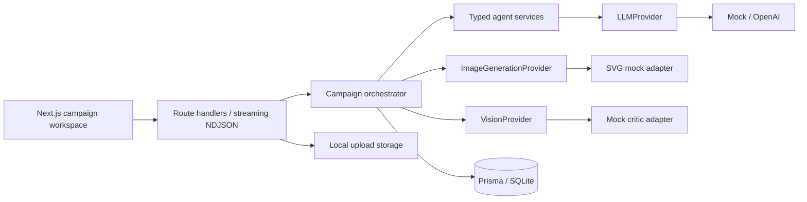
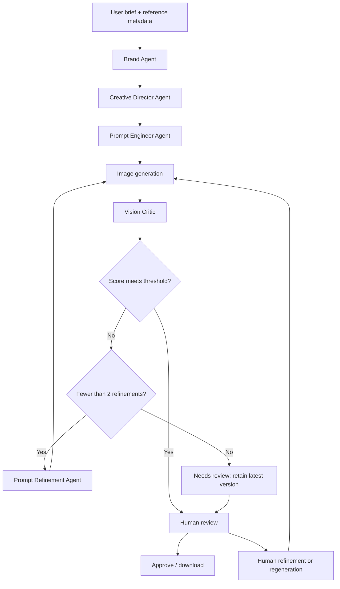

# Detailed provider and development reference

Historical implementation notes. Start with the repository README for current onboarding.

 # CreativeFlow AI

**An AI creative director for coherent brand campaigns.**

CreativeFlow turns a brief into a brand profile, creative strategy, five production prompts, campaign visuals and a reviewable feedback loop. Each stage has a clear responsibility, each generation is preserved, and the final creative decision belongs to a human.

This is a working, local-first portfolio MVP. It demonstrates **multi-agent orchestration, generative image workflows, vision feedback loops, human-in-the-loop approval, provider abstraction and AI product architecture** without requiring paid credentials.

## Screenshots

The seeded **Northline Coffee / Quiet Energy** campaign opens with five coordinated SVG mock compositions and V1/V2 histories.


## Features

- Campaign briefs with audience, objective, visual style and brand colours.
- Optional logo, product, reference and brand-guideline uploads.
- Structured Brand Agent and Creative Director outputs.
- Separate, placement-specific prompts for hero, Instagram post, story, website banner and product image.
- Visible agent activity with pending, running, completed and failed states.
- Eight critic dimensions, configurable threshold and **at most two automatic refinements per generation action**.
- Persisted prompts, scores, revision reasons and every image version.
- Version comparison, manual prompt refinement, regeneration and approval of the latest version.
- Downloadable SVG mock assets, responsive dark workspace and accessible native dialogs.
- Prisma + SQLite storage, database-backed per-campaign write leases and resumable failed workflows.
- Deterministic mock providers by default; optional OpenAI structured text adapter.

## Quick start

### Requirements

- **Node.js 22.13+ LTS** recommended (minimum Node 20.19).
- npm; no database server, Docker or API keys required.

After cloning this repository, run from the project directory:

```bash
npm ci
npm run setup
npm run dev:all
```

Open **http://127.0.0.1:3000**.

`setup` copies `.env.example` to `.env` only when missing, creates the local SQLite file, generates Prisma Client, applies the schema and seeds Quiet Energy. It is safe to rerun: the completed seed is reused. SQLite URLs are relative to `prisma/schema.prisma`. Creating the empty database file first also avoids a Prisma schema-engine initialization issue on Windows.

To verify and run a production build locally:

```bash
npm run lint
npm run typecheck
npm test
npm run build
npm start
```

Stop the dev server before running a production build, because both use `.next`. Both start commands bind to localhost. Run `npm run setup` before tests; tests create and remove only their own test campaigns in the configured database. Use a separate `DATABASE_URL` and apply the schema first if you prefer an isolated test database.

### Try the workflow

1. Open **Quiet Energy**, select an asset, and inspect Direction, Prompt and Review.
2. Compare V1 (77/100) with V2 (89/100). These are **simulated scores**, not image measurements.
3. Create a campaign. Use the example brief or write your own.
4. Watch the agent stages complete and inspect the resulting brand profile.
5. Refine a prompt with your feedback, compare the new versions, then approve the latest asset.
6. Download the SVG composition. Previous generations remain available after regeneration.

## Architecture



```text
app/
  api/campaigns/       Campaign creation, retrieval, run, upload and approve routes
  api/uploads/        Validated local-file retrieval
  api/config/         Public provider names and refinement settings; no secrets
components/
  campaign/           Workspace, brief dialog, inspector and modal primitives
  workflow/           Agent progress visualization
lib/
  agents/             Brand, direction, prompt, refinement and orchestration
  providers/
    llm/              Typed structured-output contract, mock and OpenAI adapters
    image/            Image contract and original SVG mock renderer
    vision/           Vision contract and deterministic mock critic
  database/           Prisma singleton, creation and view serialization
  storage.ts          Local file storage boundary
types/                Zod schemas, domain types and asset specifications
prisma/               Relational schema and idempotent demo seed
tests/                Orchestration integration tests
```

The backend owns provider selection; UI components never invoke a model directly. Zod validates user input and structured LLM outputs. The optional OpenAI adapter uses the Responses API with strict JSON-schema output and validates the parsed response again. Provider failures are persisted and shown in the workspace; unsupported provider settings fail explicitly rather than silently falling back.

## Agent workflow



Five placements are processed sequentially in the MVP. For each action, an initial generation may be followed by up to `MAX_REFINEMENTS` revised generations. A low score at the limit becomes `needs_review`; it never loops indefinitely. A human can initiate a new bounded action later. A completed campaign means processing has finished, **not** that every asset is approved or meets the threshold.

Generations are immutable snapshots of the prompt, image, provider and revision reason. The latest generation owns the current asset review state. Re-running an incomplete campaign reuses completed strategy and asset work. Failed generations remain in history, including those with no evaluation if the critic failed. Concurrent writes to a campaign are rejected using an atomic SQLite lease; a stale lease expires after 30 minutes.

Generation now uses a persistent SQLite job queue and a separate local worker. The HTTP request returns a job immediately; refreshing or closing the browser does not own execution. Run `npm run dev:all` to start both processes, or `npm run dev` plus `npm run worker`. Jobs have stage progress, Cancel, Retry, preserved attempts and heartbeat-based interrupted-job recovery. See [durable generation jobs](generation-jobs.md) for lifecycle, cancellation limits and migration notes.

## Data model

| Model | Responsibility |
| --- | --- |
| Campaign | Brief, lifecycle status, timestamps and execution lease |
| BrandProfile | Structured brand context |
| CreativeDirection | Campaign concept and art direction |
| CampaignAsset | Placement, dimensions, current prompt and approval state |
| Generation | Versioned prompt, asset URI, provider and revision rationale |
| CriticEvaluation | Eight scores, overall score and feedback |
| AgentRun | Stage status, timestamps and activity message |
| Upload | File role, original name, MIME type and size |

Structured agent payloads are JSON-encoded strings for a simple, portable Prisma 6 SQLite model. Foreign keys, cascading relations and unique asset/version constraints are enforced in the database. To migrate to PostgreSQL, change the datasource provider and URL, create a fresh PostgreSQL migration and transfer records and files explicitly. Consider native JSON columns during that migration; changing the connection string alone does not migrate data.

## Environment variables

Copy-safe defaults are in `.env.example`. Never commit `.env` or credentials.

| Variable | Default | Purpose |
| --- | --- | --- |
| `DATABASE_URL` | `file:./dev.db` | SQLite database relative to `prisma/` |
| `LLM_PROVIDER` | `mock` | `mock` or `openai` |
| `OPENAI_API_KEY` | empty | Required only for the OpenAI text adapter |
| `OPENAI_MODEL` | `gpt-4.1-mini` | Structured-output capable model accessible to your account |
| `OPENAI_TIMEOUT_MS` | `60000` | Per-request deadline, including response reading; integer 1000–120000 |
| `IMAGE_PROVIDER` | `mock` | `mock` or `comfyui` |
| `COMFYUI_URL` | `http://127.0.0.1:8188` | Local ComfyUI server |
| `COMFYUI_CHECKPOINT_NAME` | empty | Required installed checkpoint filename when using ComfyUI |
| `REPLICATE_API_TOKEN` | empty | Reserved for a future Replicate adapter |
| `VISION_PROVIDER` | `mock` | Only mock is implemented in this MVP |
| `CRITIC_THRESHOLD` | `80` | Integer from 0–100 |
| `MAX_REFINEMENTS` | `2` | Integer from 0–2 |

With `LLM_PROVIDER=openai`, your brief and reference **metadata** are sent to OpenAI. Uploaded file bytes are not sent. No paid API calls occur in default mock mode, while seeding or in automated tests. The adapter uses `OPENAI_MODEL` and remains behind a `server-only` import boundary. Configuration is validated when selected; failures never fall back to mock.

### Verify the real LLM flow

1. Set `LLM_PROVIDER=openai`, a valid server-side `OPENAI_API_KEY` and `OPENAI_MODEL=gpt-4.1-mini` in `.env`. Leave `IMAGE_PROVIDER=mock` and `VISION_PROVIDER=mock`.
2. Restart the server (rebuild first if using `npm start` after source changes).
3. Create a **new campaign** with distinctive product, audience and art-direction constraints. The seeded demo intentionally stays mock, and existing strategy is reused when resuming a campaign.
4. Inspect **View activity**: successful Brand Analysis, Creative Direction, Prompt Creation and Refinement entries include `[LLM: openai]`. Check the actual Brand Agent output, direction and placement prompts against your brief. A failed entry does not prove successful generation.
5. The mock critic triggers real LLM refinement with the default threshold. Images and scores still come from mock providers, so judging the pictures cannot establish which text provider ran.

For one explicit, paid CLI verification (never part of `npm test`):

```bash
node --env-file=.env --conditions=react-server --import tsx scripts/verify-openai.ts --live
```

This creates one ceramics campaign and uses the existing orchestrator without changing provider settings. With default refinement settings, success requires 12 text requests: one brand, one direction, five placement prompts and five refinements. It records safe request statuses, agent names and checks in ignored `storage/openai-verification.json`. It refuses to repeat when that report exists; inspect the previous report before deliberately moving it aside for another paid run. There are no automatic API retries. The `react-server` condition enables the server-only boundary in Node CLI scripts and fixture-based tests; Next.js handles it automatically.

**Task 1 live verification result:** one actual request was attempted with the locally configured key. OpenAI returned HTTP 401 on Brand Analysis. The workflow failed safely without mock fallback or additional requests. A successful real end-to-end output verification remains pending a valid key. Automated coverage validates transport/schema handling and all four agent entry points without paid calls.

## Providers and extension points

### Language model

Implement `LLMProvider.generate<T>(StructuredRequest<T>)` and register it in `lib/providers/index.ts`. Each agent supplies its instruction, context, validation schema and a deterministic mock factory. The OpenAI implementation has a configurable 60-second default timeout, rejects incomplete/refused outputs, validates both the response envelope and domain output, and never returns credentials or raw upstream error bodies to the UI. Missing credentials, HTTP 401, HTTP 429, timeouts, malformed output and refusal/incompletion have distinct safe messages. Brief fields are explicitly selected so campaign history and image data do not inflate text requests.

### Images

Implement `ImageGenerationProvider.generate(ImageRequest)` and return `{ imageUrl, provider }`. The request includes the structured prompt, dimensions, placement, brand context, creative direction, version and reference IDs. Use this boundary for ComfyUI workflows, FLUX/SDXL through Replicate, or a local HTTP model server. Fetch reference bytes from storage inside your server-side adapter when supported.

The mock provider produces **original vector placeholder compositions**, with brand colours, brand text, placement-specific framing and version variations. It uses a generic packaging bottle even for non-coffee briefs; it is not an arbitrary-product rendering model and does not visually follow every prompt edit. There are no stock-photo dependencies or remote asset URLs. Downloads currently export SVG; add format-aware download handling with a real image adapter.

### Vision

Implement `VisionProvider.evaluate(VisionRequest)` to inspect image bytes with a vision-capable model. It receives the image URI, prompt, brand, strategy and loop iteration. Validate the returned `Evaluation` (0–100 scores). The default critic deliberately scores initial generations at 77 and first refinements at 89 so the seeded feedback loop is reproducible. It does not inspect pixels.

### References and storage

Local uploads live in ignored `storage/uploads/`, with metadata in SQLite. The MVP accepts PNG, JPEG, WebP and guideline PDFs; 5 MB per file, 8 files per campaign and 20 MB total per upload request. File signatures are checked and file IDs prevent path traversal. Files are available in **View brief**. They are **not analysed, embedded, OCRed or used as image conditioning** in the MVP. Copy essential guideline rules into the creative brief. Replace `lib/storage.ts` for cloud object storage.

## Validation

`npm test` covers full persistence, idempotent reruns, manual refinement, two-iteration limits, provider failure/retry, campaign locking, invalid configuration and basic upload/SVG safety. Lint, strict TypeScript and the production build are separate scripts. Transitive dependency overrides pin patched PostCSS, Effect and DeepmergeTS ranges; reassess them when upgrading Next.js or Prisma.

## Scope and roadmap

This is an unauthenticated, single-user localhost application. It is not ready for public multi-tenant hosting. Cross-origin writes are rejected, but authentication, request rate limits, robust streaming upload limits, malware scanning and authorization must precede public exposure.

- [x] Local durable worker queue, staged cancellation, heartbeat leases and explicit retries
- [x] ComfyUI basic text-to-image adapter
- [ ] Replicate adapters and advanced workflows
- [ ] Real vision evaluation and reference understanding
- [x] SD1.5 OpenPose ControlNet path (live photo comparison completed)
- [x] Optional product/style IP-Adapter conditioning (identity fidelity remains limited)
- [ ] Inpainting, background replacement and upscaling
- [ ] LoRA workflows and consistent product conditioning
- [ ] Cloud storage, authentication and team collaboration
- [ ] Native JSON columns and PostgreSQL migration tooling
- [ ] Pixel-level quality and brand-consistency evaluation suite

These are extension points, not claims of implemented features.

## Implementation references

- [Next.js route handlers](https://nextjs.org/docs/app/getting-started/route-handlers)
- [Prisma 6 SQLite connector](https://docs.prisma.io/docs/orm/v6/overview/databases/sqlite)
- [OpenAI structured outputs](https://developers.openai.com/api/docs/guides/structured-outputs)

## License

MIT. See [LICENSE](../LICENSE). The SVG mock artwork is original project code and included under the same license.


## ComfyUI image generation (Task 2)

Set these server-side values in .env and restart the app:

```dotenv
IMAGE_PROVIDER=comfyui
COMFYUI_URL=http://127.0.0.1:8188
COMFYUI_CHECKPOINT_NAME=your-checkpoint.safetensors
VISION_PROVIDER=mock
```

Keep your verified LLM_PROVIDER and OpenAI settings unchanged. The checkpoint must support the standard CheckpointLoaderSimple / CLIP / VAE workflow (for example a conventional SD 1.5 or SDXL checkpoint). This adapter does not support FLUX or SD3 workflows.

The server loads comfyui/workflows/basic_text2img_api.json and substitutes the existing placement prompt, negative prompt, checkpoint, dimensions, random seed and sampler settings. Defaults: COMFYUI_STEPS=20, COMFYUI_CFG=7, COMFYUI_SAMPLER=euler, COMFYUI_SCHEDULER=normal, COMFYUI_TIMEOUT_MS=300000 (maximum 600000). Each generation uses a fresh seed. Hero: 1024×768; post: 1024×1024; story: 768×1344; banner: 1536×512; product: 1024×1024. These are output sizes, not promises of checkpoint quality at those resolutions.

The adapter submits once to /prompt, polls only that job's /history, retrieves SaveImage node 9's PNG via /view, checks size and format, and saves it under storage/generated. The app serves an immutable local /api/generated/<id>.png URL. Keep storage with the SQLite database when backing up the app. Existing SVG mock versions remain available. IMAGE_PROVIDER=mock requires no ComfyUI configuration.

For manual verification, start ComfyUI, choose an installed checkpoint filename, restart CreativeFlow, and generate a campaign or regenerate one existing asset. Activity should identify [Image: comfyui], the saved generation provider should be comfyui, and the download should be a PNG. The PNG should also appear in ComfyUI's output folder. Switch back to mock and restart to compare with the deterministic SVG renderer.

Vision scores remain deterministic mock scores, so existing automatic refinement can generate additional images and make additional text-agent calls. For a single-image smoke test, temporarily set MAX_REFINEMENTS=0, regenerate one existing asset with strategy and prompts already saved, then restore the setting. The result may be marked needs_review because mock vision has not assessed actual pixels.

The durable worker supports staged cancellation and resumes locally saved images on retry. A timed-out or interrupted remote job may still finish in ComfyUI; inspect its queue before retrying. Run on a trusted local server. Generated files are retained for version history; automatic orphan cleanup is not implemented. High requested sizes can exceed GPU memory or produce poor results with small checkpoints.


## Human/dynamic quality workflow (Task 4)

COMFYUI_WORKFLOW_MODE accepts basic, quality or auto. An unset mode preserves basic behavior. The local .env now selects auto; the checkpoint is unchanged. Auto uses placement subject/composition first, then human plus motion signals in the environment/style/creative direction. Explicit product-only/no-person instructions select basic. Negative prompts and the brand audience are excluded. This is a conservative English keyword heuristic, not an LLM call; use an explicit mode for ambiguous or non-English prompts. Quality errors are surfaced, never retried through basic. To deliberately revert, set basic and restart; activity records the explicit selection.

Templates:
- comfyui/workflows/basic_text2img_api.json: unchanged single pass.
- comfyui/workflows/human_quality_api.json: first KSampler, VAE decode, bicubic ImageScale, VAE encode, second low-denoise KSampler, final decode/SaveImage. Uses standard built-in nodes only. Image-space scaling avoids the visible latent interpolation artifacts observed in the first local test. It is ordinary bicubic enlargement, not learned super-resolution.

Quality defaults (independent of existing COMFYUI_STEPS/CFG/SAMPLER/SCHEDULER, which still control basic): COMFYUI_QUALITY_STEPS=28, COMFYUI_QUALITY_CFG=6, COMFYUI_QUALITY_SAMPLER=dpmpp_2m, COMFYUI_QUALITY_SCHEDULER=karras, COMFYUI_REFINE_STEPS=16, COMFYUI_REFINE_DENOISE=0.25. Denoise is limited to 0.05–0.4; start at 0.2–0.3 to limit pose changes. These are practical starting points for the current majicMIX checkpoint, not a measured optimal preset. More steps and moderate CFG allow a less aggressive first pass than high guidance; smaller base canvases reduce the burden of generating an entire person at large dimensions. Changing sampler/settings cannot enforce anatomy.

| Placement | Base | Final |
| --- | --- | --- |
| Hero | 768×576 | 1024×768 |
| Post | 640×640 | 1024×1024 |
| Story | 512×896 | 768×1344 |
| Banner | 1152×384 | 1536×512 |
| Product | 640×640 | 1024×1024 |

Aspect ratios are preserved with no crop. A wide banner remains difficult for full-body subjects. Low-denoise refinement may preserve an already incorrect pose; it is not an anatomy repair stage. Final PNG sizes/storage/downloads and generation versions remain unchanged. Activity and generation reason identify the selected mode and selection reason. COMFYUI_SEED can be set to an integer from 0 to 4294967295 for comparisons; leave empty for fresh random seeds. Both stages use the same seed. Different base resolutions mean a same-seed comparison is not an identical starting noise field or a controlled pose comparison.

Quality prompts preserve the input structured prompt in history and transform it only at submission. They prepend sharp-body, separated-limb, natural-proportion instructions; running prompts include two arms/two legs and natural running biomechanics. Conflicting motion-blur phrases are replaced with sharp subject detail. Blur is requested only for the background/environment/light trails. Existing negatives are retained and deduplicated with extra/duplicated/fused/missing/disconnected limbs, extra legs/feet, malformed legs/hands, twisted ankles, deformed feet, unnatural pose, bad anatomy/proportions, duplicate person, multiple bodies, distorted joints and blurry limbs/shoes. These English text constraints are advisory and may not be followed by the checkpoint.

### Earlier local pose capability inspection (superseded by sports_pose below)

The server advertised OpenposePreprocessor and DWPreprocessor and built-in ControlNet loader/apply nodes. Its ControlNetLoader model list contained canny, depth, edge, IP-Adapter and FLUX files, but no advertised compatible SD1.5 OpenPose model. Installed preprocessing nodes alone do not provide pose conditioning; their auxiliary model weights were not exercised. No pose workflow was enabled and no model was downloaded or replaced.

Later pose conditioning needs an SD1.5-compatible OpenPose ControlNet such as control_v11p_sd15_openpose.pth, its required configuration, a suitable pose map (or a reference plus functioning preprocessor and auxiliary weights), and validated LoadImage/ControlNetLoader/ControlNetApplyAdvanced links into the sampling conditioning. See the [official ControlNet 1.1 models](https://huggingface.co/lllyasviel/ControlNet-v1-1/tree/main). Do not substitute a depth/canny/FLUX model for OpenPose. This was the state at that inspection; the sports_pose implementation and installation below supersede it.

### Reproduce the live comparison

Run node --env-file=.env --conditions=react-server --import tsx scripts/compare-comfyui-quality.ts --live. This explicitly submits two GPU jobs, creates a Midnight Pulse comparison campaign, and saves basic/quality as versions 1/2 of a hero asset. It uses a hand-authored running prompt, deterministic fixture strategy, seed 20260916, and no LLM calls. Mock vision runs only to preserve the existing orchestration; its score is not evidence about anatomy. No live calls are part of npm test. Existing automatic refinement is disabled only inside this comparison process.


Local comparison result (2026-09-16): campaign Midnight Pulse — workflow comparison, ID cmu416g9w0000v16gqandk68k. Version 1 is basic; version 2 records the discarded latent-upscale trial; version 3 uses the final image-space quality workflow. The basic image produced two people despite requesting one, with softer shoes and less distinct limb edges. Final quality produced one person with two visible arms/two legs and clearer shoes/body edges, with background light trails. The stride is still crossed, the front leg looks overextended, and the rear ankle/foot connection is not convincing enough to certify. Neither output follows the requested side view faithfully; wet-street fidelity and logo suppression are also imperfect. No obvious extra limb is visible in version 3, but one paired sample does not establish anatomical reliability. The intermediate latent trial had visible body/shoe artifacts and was replaced; its history is preserved. No real vision model evaluated these images.


## Real OpenAI Vision Critic

Set VISION_PROVIDER=openai, VISION_MODEL=gpt-4.1 and the existing server OPENAI_API_KEY, then restart. OPENAI_TIMEOUT_MS controls the shared Responses API timeout (default 60000, permitted 1000–120000 ms). Local configuration now selects OpenAI vision; .env.example retains mock as the credential-free default. Mock evaluations remain deterministic. VISION_MODEL is independent of OPENAI_MODEL. A model must support image inputs and strict structured output; unavailable/incompatible models fail clearly, without fallback. See [GPT-4.1 capabilities](https://developers.openai.com/api/docs/models/gpt-4.1) and [OpenAI image inputs](https://developers.openai.com/api/docs/guides/images-vision).

The critic reads only generated PNGs through the storage boundary, never arbitrary URLs, paths or reference uploads. It validates/decodes pixels with Sharp, rejects files above 32 MB or 16 million decoded pixels, and creates a metadata-free JPEG at quality 90 with longest side at most 1536 (no enlargement, no crop). The prepared payload is bounded at 4 MB and sent as an inline image with high detail. Mock SVGs are unsupported in real vision mode: use ComfyUI PNGs or switch VISION_PROVIDER=mock. The image and objective, brand profile, direction, generation prompt, placement and version are sent to OpenAI; local paths/API credentials are not included in the model context, UI or logs. This sends image content off the machine when enabled. Responses use store:false; this setting does not itself promise zero provider retention.

Every review checks the eight existing 0–100 creative scores plus visible person count, limb duplication/plausibility, arms/legs, feet/ankles, visible hands, proportions, pose, product structure, duplicated product parts and prominence. Findings distinguish visible observation, interpretation/uncertainty and prompt-level correction. Hidden anatomy is not assumed missing. These are visual-quality assessments, not medical judgments or reliable anatomical certification. No previous score or iteration number is supplied, and version numbers must not be treated as evidence of improvement.

### Scoring policy

Overall is deterministic: round the mean of the eight component scores, subtract a category penalty, apply a defect cap, and clamp to 0–100. For each distinct blocking category (anatomy, product, composition, prompt_adherence, other), take only its highest severity: medium subtracts 8, high subtracts 20. Repeated observations in the same category do not multiply penalties. Any medium blocker caps overall at 69; any high blocker caps it at 49. Medium/high integrity concerns are also promoted to blockers even if the model omitted them from blockingIssues. The policy identifier, component mean, penalty and cap are saved. This is a transparent editorial rule, not a calibrated quality metric. A blocking issue prevents automatic ready status even with a low custom threshold; human review remains available. Existing refinement count and prompt-refinement flow are unchanged.

The Review tab labels the actual saved critic provider/model, shows structural checks and blockers, and lets you inspect older reviews of that same image. Every generation retains its own evaluation. Re-reviewing an existing generation archives its previous evaluation inside the existing JSON data before saving the latest; the database schema is unchanged. Older mock reviews remain labeled mock. Corrections are passed through the existing feedback field to Prompt Refinement.

### Manual verification performed

Two successful paid gpt-4.1 reviews inspected existing PNGs; no images were regenerated. Two earlier requests were rejected for a nested JSON-schema reference error before evaluation; the shared converter now emits an inline schema and tests guard against that regression. The score policy was recalculated locally from the saved successful responses without additional paid requests, and initial scores remain archived.

- Tidal Field hero version 3 (generation cmu3pa06r0003v17cv4vw7fdx): structurally plausible ceramic objects; no product deformation detected. The critic correctly identified that the teapot competes with the intended hero mug and that requested mug features are not clear. Component mean 79; two medium categories subtract 16; final 63. This is visually acceptable as a still life, not a campaign-ready mug advertisement.
- Midnight Pulse comparison version 2 (generation cmu416oya000kv16gnjuzeugv): identified misshapen/blurred shoes and a twisted-looking foot/ankle, with weak product focus. Component mean 73; three medium categories subtract 24; final 49. It reported one visible person and did not claim duplicated limbs. It considered the overall pose plausible, so the live test does not establish dependable pose-error detection.

To review an existing image explicitly, run node --env-file=.env --conditions=react-server --import tsx scripts/verify-vision.ts --live /api/generated/<id>.png. Each supplied image makes one paid vision request. The script stores a review on the matching generation, records Vision: openai activity, and preserves prior evaluations; it does not regenerate images, automatically refine them, or change approval decisions. Never run this script as an automated test. Existing PNGs/metadata remain unchanged.

Limitations: vision can miss or invent defects; product identity cannot be verified without a real product reference. JPEG preparation may soften tiny details. Keyword-driven generation workflow selection is unchanged. Automatic refinement can still fail to repair anatomy; later versions receive independent reviews. Provider failures preserve earlier evaluations and do not trigger a mock fallback. Only generated PNG storage is supported by this initial critic.


## Vision-driven bounded refinement

The existing orchestrator now records every attempted image version before contacting the provider. Decisions use the current evaluation independently: score at least CRITIC_THRESHOLD and no blockers stops; otherwise the loop may refine, with at most MAX_REFINEMENTS automatic revisions per asset invocation (0–2). A new user-initiated run starts a new bounded invocation, not a reset of version history. Human approval is never automatic. Blocking categories take precedence over a high score. Provider failures stop immediately and are not treated as weak images or retried silently.

The existing Prompt Refinement Agent now returns a schema-validated object containing the revised structured prompt (positive fields plus negative_prompt), a concise reason and targetedCorrections. It receives the original/current prompts, placement, brand, direction, only the current evaluation's scores/integrity/blocking issues/findings, current workflow mode and generation ID/version. Prior evaluation archives are excluded. Instructions prioritize concrete blockers and preserve successful lighting, palette and direction. Empty, unchanged or malformed results stop before another image request. Mock vision and deterministic mock prompt changes remain available.

An anatomy blocker gives the subsequent ComfyUI request a quality preference, overriding even a configured basic choice for that revision. The selection reason is recorded. The preference stays in effect for the remainder of that bounded invocation. It uses the existing quality template and checkpoint; no new generation architecture, model or conditioning is introduced. Failures never downgrade to basic. Each new image receives an independent review; scores may decrease.

Generation context is stored alongside the prompt under _generation in the existing JSON column, without changing the SQLite schema. It includes workflow mode/reason, parent generation ID/version, automatic refinement index, targeted corrections, and stop/failure details. The public prompt remains the existing structured image prompt; context is exposed separately. Image-provider failures retain an image_failed version with no image URL; vision failures retain the generated image with evaluation_failed and no fabricated score. Invalid refinements preserve the last image/evaluation with refinement_failed and the error. Activity records decisions, prompt revisions, re-evaluation and stopping reasons. Prompt inspection shows workflow, parent version, corrections and errors; failed image slots avoid broken image requests. Earlier generations/evaluations are untouched.

### Live loop verification

Run node --env-file=.env --conditions=react-server --import tsx scripts/verify-closed-loop.ts --live <campaignId> <assetId>. This requires openai/comfyui/openai providers and existing saved brand/direction/prompt context, and bounds this process to one automatic refinement. It may make paid text/vision requests and real GPU jobs; it is not included in automated tests.

The local Midnight Pulse hero test generated version 4 using auto-selected quality. Real vision scored it 93/100 with no blocking issues (threshold 80). Exact stop: Refinement stopped: threshold met; no blocking issues. Accordingly no revised prompt, second image, or second evaluation was requested. This live run validates generation → real vision → acceptable-image early stop; the real paid refinement/regeneration branch was not exercised because the initial result passed. No improvement or blocking-issue change can be claimed from this run. Offline integration tests cover high-score blockers, full refinement context, quality preference, a decreasing second score, strict limits and provider/invalid-output failures.

Limitations: a high critic score is not a guarantee of anatomy or campaign fidelity. Targeted prompts may fail to repair local defects without pose or pixel-level conditioning. The app now has a local durable SQLite worker queue with heartbeat recovery and explicit retry; it does not automatically repeat interrupted external inference or provide a distributed cloud queue. No best-version selection, rollback, new approval logic, or unsupported model workflow was added.


## Sports / human-detail workflow

COMFYUI_WORKFLOW_MODE accepts basic, quality, sports, sports_pose or auto (see the pose section below). Existing basic/quality templates and explicit choices are preserved. Auto selects sports when both a human and a dynamic sports signal occur in the subject/composition, or human+motion context exists in creative direction. Explicit isolated-product/no-person compositions remain basic; static people can still select quality. An anatomy or shoe blocker during refinement can prefer sports for dynamic human scenes, even when the previous mode was basic. Non-sports anatomy concerns retain the quality preference. The reason is stored in generation context. This remains an English heuristic, with explicit mode selection for ambiguous briefs.

The new repository template is comfyui/workflows/sports_api.json. It reuses the stable placement base sizes and final output sizes from quality: first sampling, VAE decode, bicubic image scale, VAE encode, low-denoise sampling, then an optional detector-driven face detail stage before SaveImage. The checkpoint is unchanged. Sports defaults: steps 32, CFG 5.5, DPM++ 2M, Karras; image refinement 18 steps at denoise 0.22. Configuration keys are COMFYUI_SPORTS_STEPS, COMFYUI_SPORTS_CFG, COMFYUI_SPORTS_SAMPLER, COMFYUI_SPORTS_SCHEDULER, COMFYUI_SPORTS_REFINE_STEPS and COMFYUI_SPORTS_REFINE_DENOISE. These are conservative starting points, not a calibrated optimal recipe.

Face detail defaults: COMFYUI_SPORTS_FACE_DETAIL=true, COMFYUI_SPORTS_FACE_DETECTOR=bbox/face_yolov8m.pt, COMFYUI_SPORTS_FACE_STEPS=16, COMFYUI_SPORTS_FACE_DENOISE=0.22. The Impact Pack FaceDetailer uses a 512-pixel guide, 768 maximum crop size, one cycle, a feathered local noise mask, and a face-specific positive conditioning prompt. Low denoise limits changes but cannot guarantee identity preservation. Its detector may find no face. The provider compares decoded pre/post-detail pixels and records either Detail pass applied: face or that the stage made no pixel changes. It does not claim a shoe-detail pass. FaceDetailer behavior is described in the [Impact Pack source](https://github.com/ltdrdata/ComfyUI-Impact-Pack/blob/Main/modules/impact/impact_pack.py).

Sports preflights required nodes and configured model/sampler enums through the local object_info endpoint before submitting a job. Missing dependencies produce a clear failure; there is no automatic downgrade. To deliberately run sports without face repair, set COMFYUI_SPORTS_FACE_DETAIL=false and restart. That explicit choice is recorded in history; it keeps the sports sampling and conditioning stages. The global ComfyUI timeout also bounds sports requests. Face repair adds computation and an intermediate image in the ComfyUI output directory.

Sports conditioning adds a single athlete, complete visible feet, clearly defined legs, plausible ankles, sharp shoe structure, realistic facial features, commercial photography and separated background motion. It retains the original scene prompt and deduplicates negative terms for missing/incomplete/malformed feet, deformed/fused shoes, twisted ankles, multiple people, duplicate person, bad/distorted face, malformed hands, disconnected/fused limbs and broken anatomy. Text constraints cannot repair every structural defect.

### Local capabilities actually inspected

- OpenposePreprocessor and DWPreprocessor are advertised, alongside ControlNet loader/apply nodes. The loader still has no advertised SD1.5-compatible pose ControlNet model: installed entries are canny, depth, edge, IP-Adapter and FLUX variants. Pose conditioning is therefore not fully available; no pose-aware sports workflow is enabled.
- Impact Pack FaceDetailer, DetailerForEach/SEGS and mask detailer tools are present. Ultralytics detector files include bbox/face_yolov8m.pt, bbox/hand_yolov8s.pt and segm/person_yolov8m-seg.pt. The face detector/detailer was exercised successfully in the live sports job.
- VAEEncodeForInpaint and inpaint conditioning nodes are present; ImageScale, LatentUpscale and image upscale-model nodes are present. The model list includes ESRGAN and UltraSharp files. Their advertised presence is not a claim that every possible configuration was tested.
- No dedicated foot/shoe detector was advertised. Broad person reconstruction was not added because it would risk changing the whole pose. Hand/body/SAM tools were inspected but not separately executed. No new nodes, models, LoRAs or external reference inputs were installed.

### Live quality versus sports comparison

The Midnight Pulse hero comparison used the same saved prompt, checkpoint and seed 20260917. Version 5 is quality; version 6 is sports. Both generated one visible athlete. Quality kept a smaller side-view runner with both shoes visible but relatively small local detail. Sports produced a larger subject with a clearer face/front shoe and strong background separation. Its rear shoe remains blurred, the airborne pose and ankle relationships still need human scrutiny, and unrequested bib/text details appeared. Foot/shoe reliability is not solved. The difference cannot be attributed solely to the face pass because sports also changes conditioning and sampler settings. This is a mixed result, not proven general improvement.

The face pass was confirmed by changed decoded image pixels, and detail metadata is persisted on version 6. The comparison made no OpenAI calls: temporary process-local mock vision and zero refinements were used to bound the comparison to two image jobs. Those mock scores are explicitly labeled and are not quality measurements. The app's real provider configuration and all earlier real review history remain unchanged.

Reproduce with node --env-file=.env --conditions=react-server --import tsx scripts/compare-sports.ts --live <campaignId> <assetId>. It adds two versions to the selected existing asset. Automated tests use mocked HTTP and require no running ComfyUI.

Future improvements: a compatible SD1.5 OpenPose ControlNet plus a validated pose map could constrain the skeleton; a dedicated shoe/foot detector with conservative local masks could target those regions. Neither guarantees correct details. Benchmark any alternative checkpoint separately before changing defaults; no replacement checkpoint has been verified or selected here. IP-Adapter, general reference conditioning, LoRA training and cloud/account features remain outside this task.

## Pose-aware sports workflow

Template: `comfyui/workflows/sports_pose_api.json`. This extends the existing sports graph with LoadImage → OpenposePreprocessor (body enabled; face/hands disabled) → ControlNetLoader + ControlNetApplyAdvanced → base KSampler. The low-denoise whole-image refinement and FaceDetailer remain unchanged. Pose conditioning applies to the base sampler only; the refinement and face stage retain text conditioning. The source photograph never enters the latent image or face-detail conditioning. Only the extracted body skeleton conditions the image; identity/clothing copying is not requested (similarities can still occur). Reference framing uses contain/padding to the placement's base aspect ratio rather than stretching the pose.

### Providing a pose reference

Upload one existing PNG/JPEG/WebP photograph via **New campaign → Pose reference**, or **Campaign brief → Add pose reference** for an existing campaign without a pose reference. The existing multipart upload endpoint also accepts role `pose`. Files go through project storage, limited to 5 MB, one frame, 16 megapixels and at least 64 pixels per side; they are decoded, orientation-corrected and metadata-stripped before ComfyUI upload. Use a single full-body athlete with both ankles clearly visible. No image search or generated pose is performed. One pose reference applies to that campaign's eligible placements; per-asset pose selection and reference replacement controls are not implemented.

Auto selects sports_pose for an otherwise sports scene when a stored pose image validates and OpenPose/ControlNet dependencies are advertised. Without a reference it selects sports and records that reason. An invalid reference, missing model/node or unreachable dependency check fails clearly rather than ignoring the requested pose. Explicit basic/quality/sports remain available; refinement's existing sports preference can also resolve to sports_pose with a reference. Explicit sports_pose requires a reference. Full sports node/model validation still runs before submission. Runtime preprocessor/model failures never downgrade. Completed output must include OpenPose evidence of one body with both hips, knees and ankles before a pose-success claim is recorded. Detection is checked from job history, so a poor reference can consume a GPU job before being rejected.

Activity and generation context show sports_pose, selection reason, pose-reference storage ID, model, strength, start/end percentages, and actual face-pass result. The reference image is visible in the campaign brief. No absolute local paths are sent to the UI. Existing schema, asset versions, reviews and image download/storage boundaries are retained. Failed pose preparation retains an image_failed generation record.

### Configuration

```dotenv
COMFYUI_WORKFLOW_MODE=auto
COMFYUI_OPENPOSE_MODEL=control_v11p_sd15_openpose_fp16.safetensors
COMFYUI_POSE_STRENGTH=0.8
COMFYUI_POSE_START_PERCENT=0
COMFYUI_POSE_END_PERCENT=0.85
```

Use sports_pose to force the path. Strength is bounded to 0.1–1.5, percentages to 0–1 with start < end. These are conservative starting values, not an optimal preset. The initial implementation accepts the documented control_v11p_sd15_openpose(_fp16).safetensors names; it rejects SDXL/FLUX configuration names. Filename validation does not prove file contents on another installation: use the official file/hash below. The majicMIX realistic 麦橘写实_v7.safetensors checkpoint and all current sports sampling/face settings are retained. Global .env provider settings were not changed.

### Verified local installation

Found OpenposePreprocessor, DWPreprocessor, ControlNetLoader, ControlNetApplyAdvanced, LoadImage, existing sports sampler/refinement nodes, FaceDetailer and UltralyticsDetectorProvider. This template uses OpenposePreprocessor; DWPose is not exercised. The SD1.5 pose model was absent. Downloaded the [author's fp16 safetensors file](https://huggingface.co/lllyasviel/control_v11p_sd15_openpose/blob/main/diffusion_pytorch_model.fp16.safetensors), renamed it control_v11p_sd15_openpose_fp16.safetensors, and verified SHA256 b25b1125e870275550b2a7de289056cb3c236c01c293bd5ba883657b1c006e3e. Destination: <COMFYUI_ROOT>/models/controlnet/control_v11p_sd15_openpose_fp16.safetensors. ComfyUI object_info now lists it. The installed ComfyUI loader supports this Diffusers-format ControlNet. No checkpoint was replaced.

The existing preprocessor also lacked its annotator weights. Its downloader hit a Windows path error; downloaded the three required files directly from [lllyasviel/Annotators](https://huggingface.co/lllyasviel/Annotators/tree/main), checked their repository SHA256 hashes, and successfully loaded OpenposeDetector.from_pretrained():

| File | SHA256 |
|---|---|
| body_pose_model.pth | 25a948c16078b0f08e236bda51a385d855ef4c153598947c28c0d47ed94bb746 |
| hand_pose_model.pth | b76b00d1750901abd07b9f9d8c98cc3385b8fe834a26d4b4f0aad439e75fc600 |
| facenet.pth | 8beb52e548624ffcc4aed12af7aee7dcbfaeea420c75609fee999fe7add79d43 |

Destination folder: <COMFYUI_ROOT>/custom_nodes/comfyui_controlnet_aux/ckpts/lllyasviel/Annotators/. The node loads all three weights even when hand/face detection is disabled. No custom-node code was changed.

### Verification and limitations

Offline tests cover selection, reference decoding/path validation, missing dependencies, configuration, graph links, lower-body detection evidence and mocked upload/generation/storage. Live sports-vs-sports_pose comparison subsequently completed with user-provided reference.jpg: versions 7 and 8 used the same saved prompt and seed 20260917, with two real gpt-4.1 Vision reviews. Both scored 69 after medium product-issue caps. Version 8 followed the reference pose more closely and improved front-shoe readability, but rear-shoe blur remained and left copy space decreased. Neither is a finished shoe-ad hero. Detailed direct inspection and real-review results are saved in storage/midnight-pulse-pose-comparison.md and storage/pose-live-comparison.json.

After attaching a photograph, run the following manually (two GPU jobs and two paid real Vision reviews; no automatic regeneration):

```powershell
Remove-Item Env:OPENAI_API_KEY -ErrorAction SilentlyContinue
node --env-file=.env --conditions=react-server --import tsx scripts/compare-pose.ts --live CAMPAIGN_ID ASSET_ID
# Optional final argument: a quoted local photo path, if the campaign has no pose upload yet.
```

Both modes use the same saved prompt, checkpoint and seed 20260917. Results persist as new versions with real critic reviews. Inspect both images for limbs, leg placement, ankles, complete feet, pose, face, shoes and composition; a score alone does not establish improvement. OpenPose constrains a coarse skeleton, not shoe geometry or detailed ankle structure. Occlusion and unusual poses can defeat the detector; low-denoise refinement may still change anatomy. That pose task did not add shoe-specific repair, IP-Adapter, LoRA or model migration. Optional product/style conditioning is described below.

## Product and style reference conditioning

Product/style references now affect ComfyUI pixels via a composable `comfyui/workflows/reference_conditioning_api.json` graph fragment, without replacing basic, quality, sports or sports_pose. Auto still selects the base workflow and adds optional reference conditioning independently. Product placements without an explicit human subject now ignore campaign-level running context: the live test exposed that this previously selected a person/pose workflow for a shoe close-up. Explicit modes are unchanged.

### UI and provider boundary

Upload one **Product image** and optionally one **Style reference** when creating a campaign or from Campaign brief. Existing legacy `reference` uploads are treated as style references. Multiple candidates fail rather than silently choosing the first; direct provider callers may explicitly select one from the campaign's matching uploads. Logos and PDF guidelines remain review-only and are labelled as such. The UI is provider-neutral. It offers Product/Style influence values for the next run in the current session; these are not persistent campaign settings. Defaults: product 0.8, style 0.4. Product range 0.05–1.5, style range 0.05–1. Use no upload to disable conditioning; zero is rejected instead of silently ignoring an active reference. No references means the existing generation graph and behavior, without extra adapter calls. Mock generation explicitly rejects active product/style references because it cannot apply them.

ImageRequest adds optional productReference/styleReference (storage ID + MIME) and conditioningStrength {product?,style?}. The provider also resolves campaign uploads by role. POST /api/campaigns/:id/run accepts conditioningStrength. References are checked against the supplied campaign upload list. Uploads are validated as single-frame PNG/JPEG/WebP, under 5 MB and 40 megapixels, with at least 64 pixels per side. Server-side preparation corrects orientation, strips metadata and contains/pads to a 768 square so CLIP center cropping does not cut off the product. Only storage IDs, hashes, model names and settings enter history; filesystem paths do not enter the UI.

### ComfyUI dependencies and graph

Locally inspected and already present: LoadImage, IPAdapterModelLoader, CLIPVisionLoader and IPAdapterAdvanced from ComfyUI_IPAdapter_plus. Files were found on disk and advertised by /object_info:

- models/ipadapter/ip-adapter-plus_sd15.safetensors (98,183,288 bytes)
- models/clip_vision/CLIP-ViT-H-14-laion2B-s32B-b79_CLIP-ViT-H-14.safetensors (2,528,373,448 bytes)

No nodes/models were installed or downloaded for this task. The existing majicMIX SD1.5 checkpoint is unchanged. Configuration:

```dotenv
COMFYUI_IPADAPTER_MODEL=ip-adapter-plus_sd15.safetensors
COMFYUI_CLIP_VISION_MODEL=CLIP-ViT-H-14-laion2B-s32B-b79_CLIP-ViT-H-14.safetensors
```

For another installation, follow the [node author's installation instructions](https://github.com/cubiq/ComfyUI_IPAdapter_plus). Use the [official SD1.5 Plus adapter](https://huggingface.co/h94/IP-Adapter/blob/main/models/ip-adapter-plus_sd15.safetensors) in models/ipadapter and its matching ViT-H encoder in models/clip_vision. Set COMFYUI_CLIP_VISION_MODEL to the exact advertised filename. SDXL, FaceID and ViT-G are not interchangeable with this initial path. Missing nodes/models, unsupported weight modes, corrupt references, ambiguous selections, bad upload responses and graph failures are explicit errors; no mock or unconditioned fallback is used.

Product uses IPAdapterAdvanced linear weighting to emphasize appearance/shape; style uses separate style-transfer layer weighting with a lower default strength. The installed node's source contains an SD1.5 style-transfer branch. Both references use the Plus adapter and ViT-H encoder; style is applied first and product second. Both base and whole-image refinement samplers use the patched model, while FaceDetailer keeps the original model to reduce product leakage into faces. Pose conditioning remains on the existing conditioning branch. Positive instructions prioritize reference product construction/color blocks and request style-only treatment for the style image. These instructions and layer weights reduce conflicting goals; they do not mathematically separate identity from style.

Generation context records referenceConditioning mode, adapter/encoder, reference IDs, product/style roles, actual strengths, weight types and SHA256 of source bytes. The inspector links to the exact stored references, and activity lists the applied settings. Existing JSON context carries this metadata; no database schema change or historical rewrite.

### Live verification: shoes.jpg across three placements

Used the supplied 6000×4000 shoes.jpg, a cream/grey shoe with distinctive layered overlays and striped mesh, at product strength 0.8 and seed 20260917. Exactly three initial placements were generated/reviewed, then only product was rerun after fixing the confirmed auto-selector error. Two missing placement prompts were produced by the existing real LLM; four generated images received real gpt-4.1 Vision reviews. Automatic refinement was disabled for the test; global .env was unchanged.

| Placement | Saved version / workflow | Critic overall | Direct comparison with source |
|---|---|---:|---|
| Hero | v9 / sports_pose + product | 26 | Cream/grey cues and layered patterns transferred, but shoe silhouette changed; source patterns also spread onto clothing and a large artificial accessory. Night setting became a bright studio. |
| Instagram post | v1 / sports_pose + product | 46 | Related cream/grey palette and overlays, but narrower/different sole and upper details; clothing/background contamination and stylized anatomy. |
| Product | v2 / basic + product | 44 | Strongest large-scale color/material resemblance, but exaggerated bulbous soles, stacked shoes and invented vents/details; not faithful geometry. |

The earlier product v1 (sports_pose, score 24) is retained. It incorrectly generated a runner because campaign motion context overrode the close-up prompt. The correction now keeps product-only placement in basic while still applying the reference. Hero/post were skipped on retry, so no duplicate generations were spent there.

Conclusion: the integration is functional, but this test did **not** establish dependable same-product identity across placements. The images share a visual family, not exact construction. None should be described as an approved faithful product rendering. Real critic scores are campaign-quality checks; the existing critic sees generated images and text, not the source reference, so identity comparison was done by direct visual inspection. The style-only/combined-style branches are tested offline but have not had a separate live image-quality trial. No unconditioned matched control was generated for this product test, so it does not quantify improvement over a no-reference baseline.

Global IP-Adapter conditioning can transfer source background, colors and product patterns to unrelated regions. It cannot guarantee logos, exact geometry or style/content separation. Strength tuning may help but is not proven by this run. Region masks, product compositing or a dedicated identity model would require separately scoped quality work. No model migration, training or cloud features were added.

Reproduce manually (paid API calls / GPU jobs, skips already reviewed matching references and workflow):

```powershell
Remove-Item Env:OPENAI_API_KEY -ErrorAction SilentlyContinue
node --env-file=.env --conditions=react-server --import tsx scripts/verify-product-reference.ts --live CAMPAIGN_ID '<project>/shoes.jpg'
```

Validation: npm run lint, npm run typecheck, npm test (82 tests) and npm run build passed. Full review artifacts: storage/product-live-verification.json and storage/product-live-correction.txt.

## Evaluation and version comparison

Open an asset and choose **Compare versions** to select any two saved versions. Desktop uses side-by-side images; narrow screens stack A and B. Each side includes provider provenance, workflow/reference metadata, saved prompts, negative constraints, critic findings and stopping reason. Version buttons also update the canvas, Prompt and Review panels. Expand **Version & refinement history** for the selected asset's persisted refinement chain.

Score deltas are B minus A for overall and the eight existing dimensions. Opposing changes are labelled **Mixed result**; no winner or new AI judgment is produced. Mock reviews are explicitly simulated, and differing reviewer/model/scoring policies carry a comparison warning. Missing evaluations remain unknown, not zero.

Blocker changes compare category presence: resolved means absent from B's report, new means absent from A's report, and persistent means present in both. This does not establish that two differently worded issues are identical or visually fixed. Prompt changes highlight added/removed words, including negative constraints. Very long fields use a bounded whole-field diff.

Historical records may lack workflow, references, blocker details or stop reasons; the UI says so rather than reconstructing evidence. Pose metadata is read from previously saved conditioning records. Comparison uses each version's current persisted evaluation; it does not normalize scores across critic policies or offer evaluation-revision selection. Saved prompts can precede provider-specific workflow transformations. Local paths and secret-like strings are redacted from review text.

Manual QA used existing Midnight Pulse hero V7 (sports) versus V8 (sports_pose), real versus mock reviews, version-linked inspector/timeline, and Tidal Field's legacy metadata and prompt changes. V7/V8 both scored 69; product visibility increased 3 and prompt adherence decreased 6, correctly yielding Mixed result. At a 390px viewport the comparison stacked without horizontal overflow. No new images or paid evaluations were requested.

## Brand Guideline Intelligence

Open **Brand Intelligence** in a campaign to analyse selected PDF/logo/reference/product uploads, review source-derived rules separately from inferred suggestions, edit/remove rules and approve them. Explicit conflicts pause generation until resolved. Real Vision checks visually relevant approved rules and shows per-rule findings in Review and version comparison. Existing images can be reviewed without another ComfyUI job.

See [Brand Intelligence implementation, verification and exact changed-file list](brand-intelligence.md) for the data model, limits, provenance, integration and NORTHLINE live results. No database migration or image-workflow/model changes are required.

## Durable generation jobs

Existing installations: back up SQLite and storage, stop app/worker processes, then run `npx prisma db push` (additive job tables/columns; no reset). Start `npm run dev:all`. `npm run dev` alone serves the app but does not consume the queue. For a local production build, run `npm start` and `npm run worker` with the same environment/database.

See [job architecture, exact file list, validation and limitations](generation-jobs.md). Brand material analysis and standalone compliance reviews remain existing synchronous services; campaign generation, asset regeneration and prompt refinement are queued.

## Usage and estimated costs

Campaigns, jobs/attempts and asset versions now expose expandable usage records. Settings shows workspace/provider/model breakdowns. Actual OpenAI token usage, estimated USD pricing snapshots, local ComfyUI duration and mock diagnostics are kept separately. See [Usage documentation](usage.md) for setup, soft budgets, pricing updates, export, validation and limitations.

