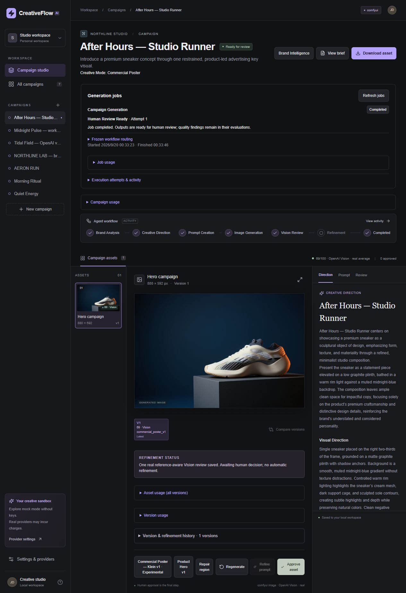
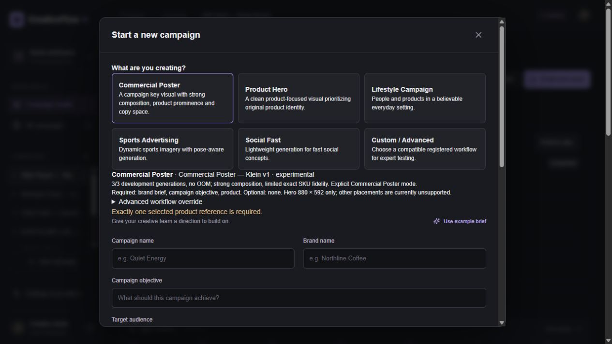
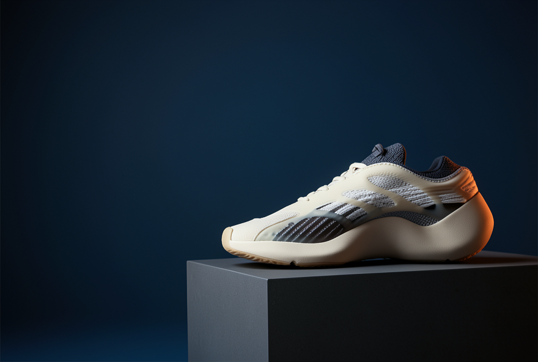
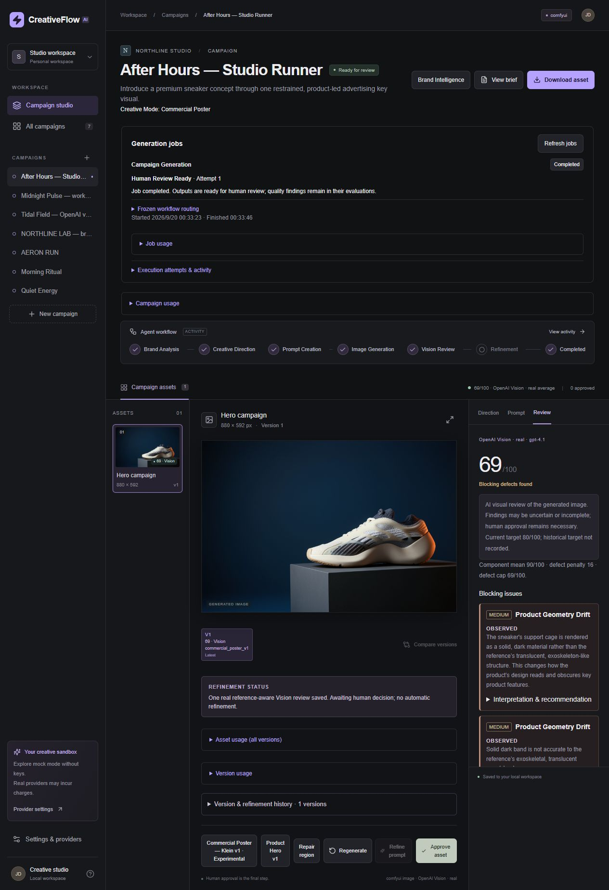
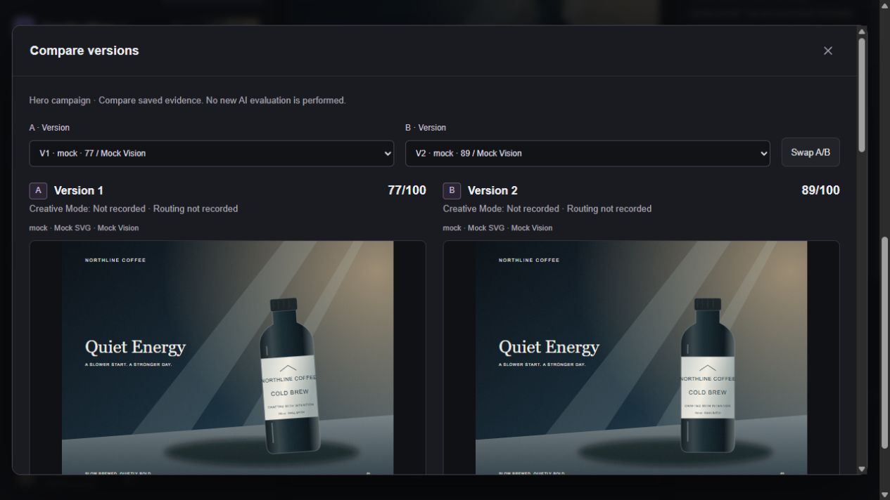
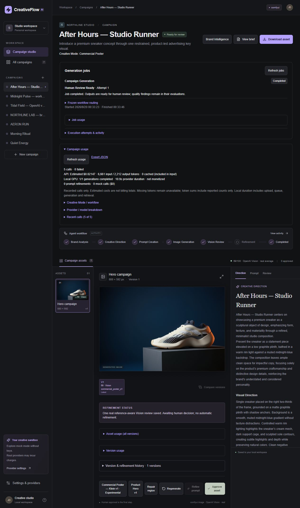

# Curated demo gallery

Captured from the running local application on 20 September 2026. No secrets or personal filesystem paths are shown. The poster PNG is the exact saved output; UI screenshots are browser captures, not design mockups.

## 1. Live campaign workspace

After Hours — Studio Runner, Hero V1. Awaiting human review, not approved.

## 2. Creative Mode selection

Mode selection exposes workflow intent and experimental status.

## 3. Real Commercial Poster output

Klein output, 880 × 592. Product structure differs from its reference; not exact SKU fidelity.

## 4. Real Vision review

69/100 with explicit product-identity blockers. No automatic refinement ran.

## 5. Mock version comparison

Quiet Energy V1/V2 from an isolated fresh seed. SVG layouts and scores are simulated, not real Vision or live poster variants.

## 6. Live campaign usage

Three text calls, one local image and one Vision review. API estimates are not billing totals; local GPU cost is unknown.

See the [complete result](../golden-demo.md). Confirm reference/media rights before publishing the gallery. Historical campaigns visible in the local workspace sidebar are development evidence, not additional golden-demo runs.
